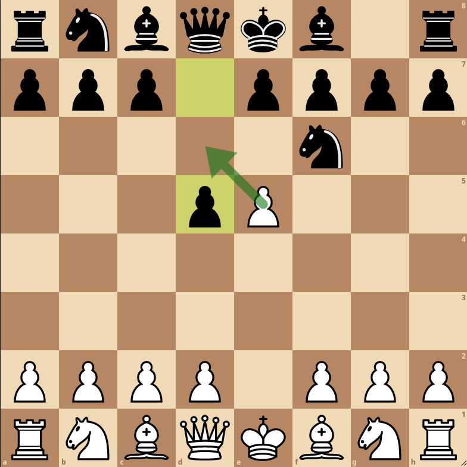

# The CEGO (Chess Engine Game Operation) protocol, revision 1
The CEGO protocol exists to answer a very specific need in Chess programming: the simple and fast operation of a Chess game between two Chess engines. All of this, while assuming little about how these engines operate. There exist other protocols to achieve this, such as the CECP, or UCI protocols. These answer a different, sometimes more general issue however, that of controlling a Chess engine in a GUI. In addition, they assume certain things on how engines implementing them operate. How can one generate a principal variation if all they are using is a neural network to pick the best move? This is not to say these protocols are bad, although they have some questionable and dated design decisions, but rather to say a better solution for the use-case described above may exist. It is the goal of this protocol to present such a solution.

This document details revision 1 of CEGO. Whenever any change will be made to the specifications of the protocol, a new revision with an incremented number will be made. It is up to mediators and engines (see "Communication") to disclose which revision they currently use/support.

## Communication
As a protocol, CEGO facilitates communication between two entities: an engine, and a mediator. A mediator here is a general term for any program which is operating a Chess game. This communication is done in plain-text, encoded in ASCII, by passing messages using the standard streams. Specifically, the mediator sends text to the standard input of the engine, and the engine sends text to its standard output. Every message must contain only a single newline, at its end. On windows, this means `\r\n`, and on other platforms, `\n`.

Due to many reasons, communication can sometimes fail, resulting in malformed updates. Therefore, it is important to understand CEGO implements no mechanisms for fault tolerance. In other words, it fails *hard* and *fast*. In addition, text in the protocol is case-sensitive, and arbitrary whitespace separators, like those seen in UCI cannot be used.

The specification here is written while only referring to the communications between the mediator and a single engine, although in actual use, the mediator would have to communicate with two Chess engines. Luckily, the protocol is entirely symmetric, making this trivial. Whenever one engine "sends a move", the mediator sends a message to the other Chess engine, using the protocol, so it can make a move. Once it does, that move is sent by the mediator to the original Chess engine, and this process repeats.

## Message styling and protocol invariants
When displaying raw text in this specification, it should be interpreted as is, unless part of it is of the form:
```
<NAME>
```
where `NAME` is some kind of "name". When this is the case, `<NAME>` is a "parameter", and may be any string, based on the restrictions provided. Throughout the specification, parameters relating to time will always be in nanoseconds, as an integer. This means that 30 seconds would be represented as `30000000000`. Additionally, any Chess moves will be represented in long algebraic notation, as seen in UCI.

### Long Algebraic Notation
Every single move in long Algebraic Notation is of the form:
```
<ORIGIN-SQUARE><TARGET-SQUARE><PROMOTION>
```

such that these parameters take on different values for different kinds of moves, as described below. In all cases however, the square parameters will contain values such as `a4`, `e7`, and others, and the promotion parameter, which represents a piece, may be a `q`, `r`, `b`, `n`, or simply nothing, representing a queen, rook, bishop, knight, and no promotion taking place respectively.

#### Normal Chess moves
For a normal Chess move, parameter values are as expected.
#### Promotions
Promotions, which of course can only happen with pawns, will have the promotion parameter set to the piece the pawn is promoted to.

#### Castling
When castling, the origin and target squares used are those of the king. This means that for a king-side castling by white, the move will be `e1g1`.

#### En passants
For en passants, the origin and target squares used are those of the pawn performing the capture. Therefore, for the following board:



the highlighted move will be `e5d6`.

## Stages

### Initialization
The first stage of CEGO is initialization, and it ensures the engine are ready for playing, as some engines have long initialization times, which can be caused by, for example, loading a neural network, downloading a tablebase, etc. Therefore, once communication begins, engines should send the message:
```
ready\n
```
as soon as it is ready to play. Note that like all messages, this one should be terminated by a newline, as seen above.

### First move
After the mediator receives the confirmation, it should send the engine a first move message, of the form:
```
<YOUR-TIME> <YOUR-INCREMENT> <OPPONENT-TIME> <OPPONENT-INCREMENT> <CURRENT-BOARD-FEN>\n
```
where `<CURRENT-BOARD-FEN>` is the current position of the board, at the time of the engine's first move, in FEN notation. Note the increments which are a part of this message. `<YOUR-INCREMENT>` should be added to the time left for the engine once it makes its move. With this in mind, one can see that this protocol doesn't support timing methods, such as Bronstein.

Once the engine makes it move, it should send a message of the form:
```
<MOVE-TO-PLAY>\n
```
where `<MOVE-TO-PLAY>` is the move it has chosen to make. Even after the engine sends its move, it is free to ponder or do anything else. This is true in general: the engine may do anything at any point in time, provided it precisely follows the protocol.

### Subsequent moves
Once the mediator receives the opponents chosen move, it should send a message of the form:
```
<YOUR-TIME> <OPPONENT-TIME> <PLAYED-MOVE>\n
```
where `<PLAYED-MOVE>` is the move the opponent made. Notice the increments are not present in this message, as they are constant throughout the game. Like in the "First move" section, the engine should reply with the move it has chosen to make. Once this is done, it will eventually receive a message of the same form as above, at which point the cycle repeats.

## Termination of the game
### By the mediator
The mediator may stop the game at any time, at which point, they should terminate the two engine processes. No notice needs to be given to the engines. Despite this, the mediator *must* stop the game if it has reached a "definite conclusion". This means either stalemate, checkmate, or a draw by FIDE rules. When a game is terminated due to a FIDE draw, the mediator must make sure the playing engine could not deliver mate in their turn.

Additionally, the mediator must stop the game if at least one of the engine processes somehow stop.

### By an engine
When the game is terminated by an engine, unlike the mediator, it must be for a specific reason, and therefore, with a specific message to the mediator.

#### Encountering a protocol error
When an engine encounters an error with the last message sent by the mediator, it will send the message:
```
error\n
```
once this message is sent, the engine may quit, and the game should be terminated by the mediator.

#### Forfeiting the game
When the engine sees fit, instead of sending the expected message, it may send the message:
```
forfeit\n
```
to notify the mediator it has forfeited the game. Once this happens, the game must be terminated, and the engine may quit. Note that there's no need to use this mechanism for ending a game due to an internal engine error, as simply stopping the engine process will terminate the game. Therefore, a forfeit should be considered a win for the other engine, at all times.
